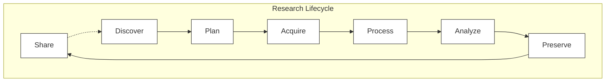

# Research Lifecycle Template

A template for conducting scientific exploration using the research lifecycle and version control.

## Summary

The research lifecycle may be defined as follows (referencing the diagram above):

> The Research Lifecycle is a heuristic model for understanding the steps of the process of scientific discovery (research), often represented in a wheel to emphasize the continuous nature of research with one project leading into the next.
> ([https://nnlm.gov/guides/data-glossary/research-lifecycle](https://nnlm.gov/guides/data-glossary/research-lifecycle))

Version control technologies (such as git) provide a consistent way to track, deploy, and collaborate on code associated with research, enabling and enhancing reproducible science. Providing a template repository for reference or direct use helps reduce costs associated with individual reinvention of common steps for any research process.

## Objectives

- Treat code as data necessary to the reproducibility of science for research project. (code becomes reproducibility outcome artifact)
- Treat documentation as code for research project. (documentation is treated with just as much importance as code and data)
- Reduce time to delivery of scientific results.
- Increase documentation of all steps, not just outcomes of scientific research project.
- Use software design principles to enhance scientific development agility.
- Incorporate automated linting for documentation, code, and data for early warning signs.

## Presumptions

This repository makes various presumptions about code and related technologies used within. The following are used for example purposes but may be changed as necessary for more specific needs.

- Python >= v3.9

## Getting Started

1. Install [Python](https://www.python.org/downloads/)
1. Install [Poetry](https://python-poetry.org/docs/#installing-with-the-official-installer)
1. Install [Dagger](https://docs.dagger.io/install/)
1. Initialize Poetry dependencies: `poetry install`
1. Initialize Dagger: `dagger project update`

## References

- Inspiration for this repository comes from work performed on the following [Data Endeavor Template](https://github.com/UCBoulder/data-endeavor-template), which is itself a continuation of ideas from [Microsoft's Team Data Science Process Project Template](https://github.com/Azure/Azure-TDSP-ProjectTemplate)
